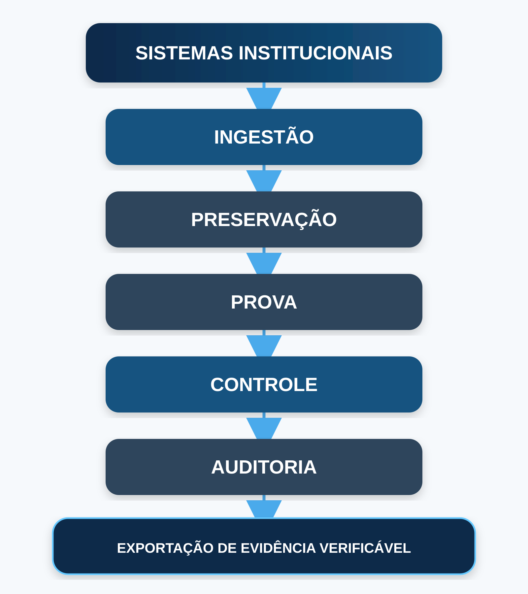
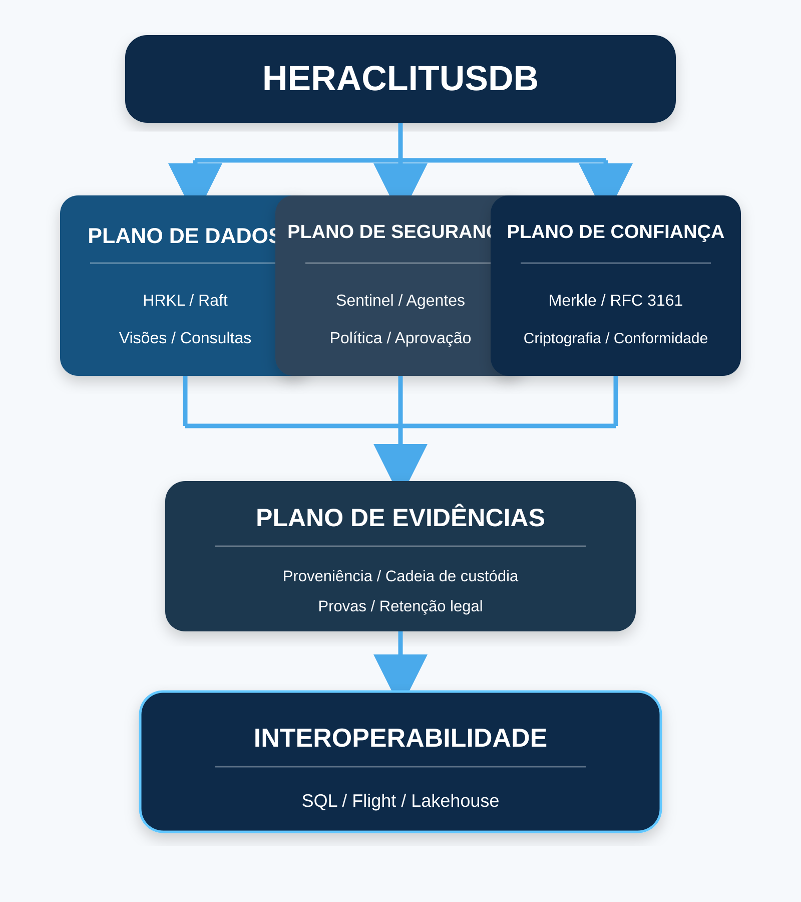
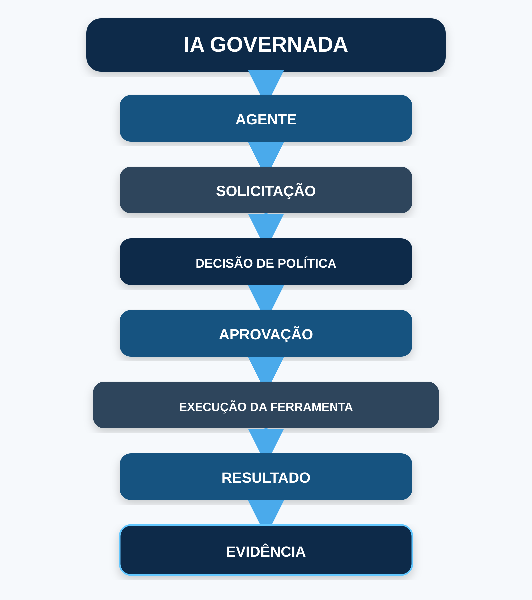
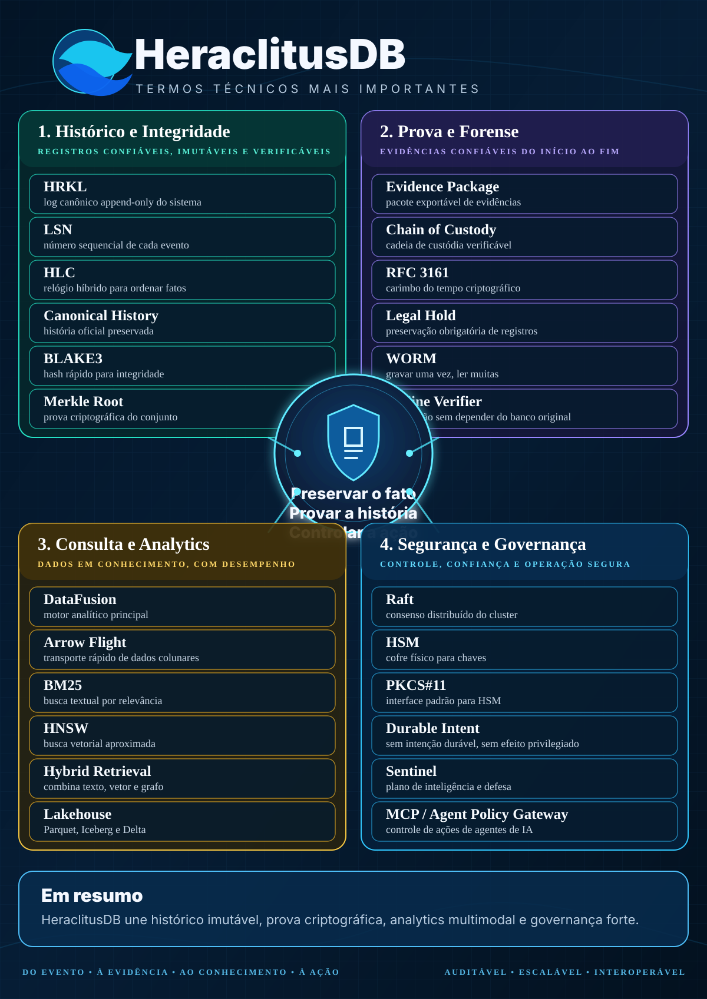

  

<h1 align="center">HeraclitusDB</h1>

<strong>Sovereign Trust, Evidence & Data Platform</strong>

  Plataforma soberana de dados, evidência, auditoria e segurança para ambientes governamentais e regulados.

  
  
  
  
  
  
  

> **Posicionamento institucional.** O HeraclitusDB é um projeto independente. Foi concebido para requisitos típicos do setor público, infraestrutura crítica e ambientes regulados, mas não é produto oficial, homologado, certificado ou endossado pelo Governo Federal brasileiro. Mapeamentos normativos e mecanismos técnicos não equivalem, por si só, a conformidade institucional, fé pública, certificação ou admissibilidade jurídica.

---

## O que é o HeraclitusDB

O HeraclitusDB não pretende ser apenas mais um banco de dados.

Ele foi projetado como uma **camada de confiança** entre sistemas que produzem dados e pessoas, órgãos ou agentes que precisam provar o que aconteceu.

A ideia é simples:

  

SIAFI, SEI, ERPs, aplicações administrativas, SOCs, sistemas policiais, plataformas de IA e bancos tradicionais podem continuar fazendo aquilo para que foram construídos.

O HeraclitusDB entra ao lado deles para preservar história, proveniência, evidência e decisão.

---

## A nova identidade do projeto

O produto passa a ser organizado em torno de cinco capacidades fundamentais:

| Capacidade | Pergunta que o sistema deve responder |
|---|---|
| **Preservar** | O que aconteceu, em qual ordem e em qual estado histórico? |
| **Provar** | Estes dados são os mesmos que foram registrados originalmente? |
| **Controlar** | Quem pode executar uma ação sensível e sob quais condições? |
| **Auditar** | Quem fez o quê, quando, em nome de quem e com qual resultado? |
| **Exportar evidência** | Um terceiro consegue verificar a prova sem confiar cegamente no servidor original? |

Essa orientação muda o papel do banco.

  

---

## Por que isso importa

Em sistemas tradicionais, a pergunta comum é:

> Qual é o valor atual?

Em sistemas de auditoria, segurança e investigação, as perguntas são diferentes:

> Qual era o valor naquele momento?  
> Quem o alterou?  
> O estado anterior ainda pode ser reconstruído?  
> O registro foi adulterado?  
> O operador tinha autorização?  
> A ação foi aprovada por quem?  
> A prova continua verificável fora do sistema?

O HeraclitusDB foi construído para tornar essas perguntas propriedades do sistema, e não uma coleção de convenções espalhadas por logs, planilhas e boa vontade humana.

---

## Casos de uso

### Auditoria e controle

- trilhas imutáveis de sistemas administrativos;
- reconstrução temporal de estados;
- auditoria de decisões e operações privilegiadas;
- preservação de eventos contábeis, financeiros e operacionais;
- detecção de alterações retroativas incompatíveis com a história registrada.

### Segurança cibernética

- ingestão e correlação de eventos de segurança;
- investigação temporal;
- grafo de incidentes;
- regras Sigma e threat intelligence;
- investigação assistida por IA;
- resposta governada e auditável;
- evidência de ações executadas por agentes.

### Perícia e cadeia de custódia

O roadmap GOV-BR adiciona uma camada forense dedicada para:

- pacote de evidência verificável;
- cadeia de custódia;
- SHA-256 + BLAKE3;
- prova de inclusão Merkle;
- carimbo do tempo;
- assinatura institucional;
- verificador offline;
- relatório técnico derivado da prova estruturada.

Esse trabalho está especificado na **SPEC-0087** e não deve ser tratado como concluído enquanto o código e os gates correspondentes não existirem.

### IA governada

O Agent Gateway e o plano de evidência de agentes permitem que chamadas de ferramentas sejam observadas, avaliadas por política, bloqueadas, aprovadas e registradas.

O objetivo não é confiar em um agente porque ele “parece inteligente”.

O objetivo é poder reconstruir:

  

---

# O que existe hoje

Esta seção descreve capacidades presentes no código atual. O arquivo **docs/md/SPEC-new/STATUS.md** continua sendo a autoridade detalhada sobre maturidade e lacunas.

## HRKL: história canônica append-only

O HRKL é o núcleo persistente do HeraclitusDB.

A linha atual inclui:

- log append-only;
- LSN e HLC;
- CRC-32C em formatos recentes;
- raízes Merkle com BLAKE3;
- formato HRKL v6;
- modos RAW e PACKED;
- manifesto HRKM;
- índices laterais HRKI;
- migração de formatos anteriores;
- tiering e lifecycle;
- exportação para lakehouse.

O estado derivado pode ser reconstruído. A história canônica não é tratada como cache descartável.

## Consulta e analytics

O workspace inclui:

- índices de texto;
- índice vetorial;
- grafo temporal;
- atributos;
- recuperação híbrida;
- consultas temporais;
- integração analítica com Apache DataFusion;
- rota SQL;
- Arrow Flight parcial;
- Parquet, Iceberg e Delta no plano lakehouse.

O roadmap de interoperabilidade está na **SPEC-0090**.

## Replicação

O projeto inclui consenso Raft sobre openraft, com transportes TCP e gRPC, snapshots e mecanismos de fail-closed quando o cluster é configurado para exigir consenso.

Isso não elimina a necessidade de qualificação física, testes de perda de host, partição real de rede e exercícios independentes.

## Compliance e tempo confiável

O crate heraclitus-compliance já contém infraestrutura para:

- RFC 3161;
- validação CMS;
- cadeia X.509;
- EKU;
- imprint;
- nonce;
- política;
- CRLs offline;
- TrustStore configurável;
- cliente HTTPS estrito para TSA;
- Legal Hold persistente;
- crypto-shredding.

**Limite atual importante:** o repositório não distribui confiança institucional pronta. Âncoras reais ICP-Brasil devem ser instaladas e verificadas pelo operador, e a interoperabilidade com uma ACT real precisa ser qualificada externamente.

## Sentinel

O Heraclitus Sentinel reúne funções de:

~~~text
L0  normalização
L1  regras
L2  baseline
L3  correlação/grafo
L4  investigação assistida
L5  política
L6  execução governada
~~~

Threat Intelligence, TAXII/MISP e outros componentes possuem diferentes graus de implementação e integração. O STATUS.md deve ser consultado antes de qualquer claim de produção.

## Agent Evidence & Gateway

O projeto inclui:

- proxy MCP;
- modos observe, shadow e enforce;
- aprovação humana;
- proteção contra replay;
- expiração;
- binding de identidade;
- evidência persistente;
- red-team telemetry;
- barreiras contra flood e bypass lógico dentro do perímetro controlado.

Nenhuma camada de software pode impedir um agente de contornar o gateway se o operador lhe entregar credenciais e rota de rede direta para o upstream. A topologia continua fazendo parte do modelo de segurança.

---

# GOV-BR: a próxima camada de confiança

As SPECs 0086–0091 reorganizam a evolução do projeto em torno de confiança institucional.

| SPEC | Objetivo | Status |
|---|---|---|
| **SPEC-0086** | HSM/PKCS#11, KeyProvider, chaves por tenant, rotação e destruição controlada | Proposed |
| **SPEC-0087** | pacote forense e cadeia de custódia verificável | Proposed |
| **SPEC-0088** | compliance profiles as code para ambiente governamental | Proposed |
| **SPEC-0089** | protocolo administrativo fail-closed com Durable Intent | **P0 / Blocker** |
| **SPEC-0090** | PostgreSQL wire, Flight e interoperabilidade aberta | Proposed |
| **SPEC-0091** | WORM, retenção externa e Legal Hold reforçado | Proposed |

Veja o roadmap consolidado em:

**[ROADMAP-GOV-BR.md](docs/md/SPEC-new/ROADMAP-GOV-BR.md)**

---

## SPEC-0089: Trusted Administration

Esta é a prioridade arquitetural imediata.

O princípio é:

~~~text
NO DURABLE INTENT
      =>
NO PRIVILEGED SIDE EFFECT
~~~

Uma futura operação crítica deverá seguir:

~~~text
Authenticate
    |
Authorize
    |
Policy
    |
Approvals
    |
Durable AdminIntent
    |
fsync / quorum
    |
Execute
    |
Durable AdminResult
    |
Reconcile if necessary
~~~

Isso é especialmente relevante para:

- crypto-shred;
- Legal Hold;
- rotação ou destruição de chaves;
- retenção;
- exportação forense;
- mudanças críticas de configuração;
- operações administrativas destrutivas.

O objetivo é eliminar a classe de sistema que executa primeiro e tenta explicar depois.

---

## SPEC-0086: HSM e domínio criptográfico por órgão

A arquitetura proposta introduz uma fronteira KeyProvider:

~~~text
KeyProvider
   |
   +-- Software
   +-- PKCS#11 / HSM
   +-- Institutional KMS
   +-- Test Provider
~~~

Em ambientes endurecidos, chaves privadas podem permanecer não exportáveis dentro do HSM.

A separação multi-tenant prevista passa a ser criptográfica, não apenas lógica:

~~~text
Tenant A -> KEK-A -> DEKs-A
Tenant B -> KEK-B -> DEKs-B
Tenant C -> KEK-C -> DEKs-C
~~~

A indisponibilidade de um HSM exigido pela política deve falhar fechado, sem fallback silencioso para arquivo local.

---

## SPEC-0087: evidência que sai do banco ainda sendo verificável

O objetivo do plano forense é produzir um pacote semelhante a:

~~~text
EvidencePackage/
├── manifest.json
├── evidence/
├── provenance/
├── proofs/
├── certificates/
├── sbom/
└── report/
~~~

O manifesto estruturado é a autoridade. PDF é apresentação.

O verificador deve conseguir determinar offline:

~~~text
PACKAGE STRUCTURE      PASS
OBJECT DIGESTS         PASS
CUSTODY CHAIN          PASS
MERKLE PROOF           PASS
TIMESTAMP              VERIFIED / UNVERIFIED
SIGNATURE              VERIFIED / UNVERIFIED
OVERALL TECHNICAL      VERIFIED / PARTIAL / FAILED
~~~

Ausência de confiança externa nunca deve virar PASS por entusiasmo.

---

## SPEC-0088: compliance como evidência, não como selo

O HeraclitusDB não deve afirmar simplesmente:

~~~text
COMPLIANT = true
~~~

O modelo proposto trabalha controle por controle:

~~~text
PASS
FAIL
PARTIAL
NOT_APPLICABLE
EXTERNAL
UNKNOWN
NOT_ASSESSED
~~~

Perfis governamentais poderão mapear requisitos como LGPD, PPSI, GSI, ICP-Brasil e regras internas do órgão.

Cada PASS automatizado deve apontar para evidência concreta de build, teste, configuração ou qualificação.

Processos que dependem do operador, da organização ou de laboratório externo continuam explicitamente marcados como tais.

---

## SPEC-0091: Legal Hold além do próprio processo

Nenhum programa executando no mesmo host consegue prometer honestamente resistência absoluta ao administrador que controla kernel, disco, binário e configuração.

Por isso o roadmap prevê uma fronteira externa:

~~~text
Heraclitus Legal Hold
        +
Immutable Store
        +
WORM / Object Retention
        +
separate credentials
        +
receipts
        +
external verification
~~~

Isso permite distinguir:

- imutabilidade lógica;
- retenção física externa;
- verificação da retenção;
- qualificação do ambiente.

---

# Interoperabilidade

O HeraclitusDB não quer exigir que cada órgão adote um ecossistema proprietário para consultar seus próprios dados.

A estratégia é priorizar protocolos e formatos abertos:

~~~text
HeraclitusDB
   |
   +-- Native API
   +-- gRPC
   +-- Arrow Flight
   +-- PostgreSQL wire         [roadmap]
   +-- Parquet
   +-- Iceberg
   +-- Delta
~~~

Ferramentas como Power BI, DBeaver, Superset, Trino e plataformas analíticas devem preferencialmente chegar pelos protocolos comuns, sem colocar SDKs específicos de cada fornecedor dentro do core.

---

# Arquitetura do workspace

O workspace Rust 3.0.1 é dividido em crates especializados.

~~~text
heraclitus-core              tipos, runtime e tempo lógico
heraclitus-log               HRKL, persistência e integridade
heraclitus-crypto            criptografia
heraclitus-compliance        confiança, recibos, TSA e retenção
heraclitus-memtable          estado recente
heraclitus-views             materializações
heraclitus-index-vector      índice vetorial
heraclitus-index-graph       grafo temporal
heraclitus-index-text        recuperação textual
heraclitus-index-attr        atributos
heraclitus-retrieval         fusão de recuperação
heraclitus-query             camada de consulta
heraclitus-analytics         DataFusion e analytics
heraclitus-raft              consenso e replicação
heraclitus-gpu               aceleração
heraclitus-agent             governança de agentes
heraclitus-agent-gateway     policy gateway
heraclitus-sentinel          segurança e investigação
heraclitus-case              casos
heraclitus-content           conteúdo e playbooks
heraclitus-platform          superfície integrada
hume-kernel / hume-ir        infraestrutura experimental HUME
~~~

A lista canônica está em [Cargo.toml](Cargo.toml).

---

# Modelo de implantação

~~~text
                  SISTEMAS DO ÓRGÃO
                        |
         +--------------+--------------+
         |              |              |
        APIs           Logs          Events
         |              |              |
         +--------------+--------------+
                        |
                        v
                +----------------+
                |  HeraclitusDB  |
                +----------------+
                        |
         +--------------+--------------+
         |              |              |
         v              v              v
      AUDIT          SECURITY       ANALYTICS
         |              |              |
         +--------------+--------------+
                        |
                        v
                 TRUST / EVIDENCE
                        |
           +------------+------------+
           |                         |
           v                         v
    Internal Verification      External Evidence
                               ACT / HSM / WORM
                               when configured
~~~

O projeto prioriza:

- on-premises;
- redes segmentadas;
- ambientes sem Internet;
- operação soberana;
- reconstrução determinística;
- evidência local verificável;
- dependências externas explícitas em vez de escondidas.

---

# Casos de uso institucionais possíveis

O HeraclitusDB é especialmente adequado para avaliação em cenários onde **a história importa tanto quanto o estado atual**:

- trilhas de auditoria de sistemas administrativos;
- custódia de eventos e evidências digitais;
- controle interno e corregedoria;
- segurança cibernética;
- investigação de fraude;
- registros de agentes de IA;
- processos com necessidade de reconstrução temporal;
- preservação de logs de infraestrutura crítica;
- integração lakehouse onde o dado canônico precisa permanecer verificável.

Cada caso exige análise jurídica, de segurança, privacidade e arquitetura do órgão. A existência da tecnologia não decide sozinha se aquele uso é permitido.

---

# Maturidade: linguagem de claims

O projeto adota cinco níveis conceituais:

~~~text
DESIGNED
IMPLEMENTED
TESTED
QUALIFIED
EXTERNALLY ATTESTED
~~~

Eles não são sinônimos.

Exemplos:

- uma SPEC escrita está DESIGNED, não IMPLEMENTED;
- código com testes pode estar TESTED, mas não QUALIFIED;
- suporte PKCS#11 não significa HSM homologado;
- RFC 3161 implementado não significa ACT real qualificada;
- Legal Hold lógico não significa WORM físico;
- perfil PPSI não significa órgão conforme;
- pacote forense não garante admissibilidade judicial.

Essa distinção é parte do produto, não uma nota de rodapé.

---

# Início rápido

~~~bash
git clone https://github.com/JoseRFJuniorLLMs/HeraclitusDB.git
cd HeraclitusDB
cargo build --release
~~~

Documentação de início:

- [Quickstart](docs/getting-started/quickstart.md)
- [Deployment](docs/wiki/DEPLOYMENT.md)
- [Operations](docs/wiki/OPERATIONS.md)

---

# Documentação

| Documento | Conteúdo |
|---|---|
| **[Wiki Home](docs/wiki/Home.md)** | visão executiva |
| **[Government](docs/wiki/GOVERNMENT.md)** | soberania e setor público |
| **[Architecture](docs/wiki/ARCHITECTURE.md)** | arquitetura |
| **[Security & Compliance](docs/wiki/SECURITY-COMPLIANCE.md)** | controles e evidência |
| **[Deployment](docs/wiki/DEPLOYMENT.md)** | implantação |
| **[Operations](docs/wiki/OPERATIONS.md)** | operação e runbooks |
| **[Roadmap](docs/wiki/ROADMAP.md)** | evolução |
| **[ROADMAP-GOV-BR](docs/md/SPEC-new/ROADMAP-GOV-BR.md)** | confiança, evidência e interoperabilidade |
| **[SPEC-STATUS](docs/md/SPEC-new/STATUS.md)** | estado real das especificações |
| **[SPEC-RESUMO](docs/md/SPEC-new/SPEC-RESUMO.md)** | inventário verificado |
| **[Production blockers](docs/BLOQUEIOS-PRODUCAO.md)** | bloqueios conhecidos |
| **[Qualification](docs/qualification/)** | provas e gates |
| **[Security](docs/security/)** | segurança e vulnerabilidades |

---

# GOV-BR Specs

- [SPEC-0046 — Government Compliance](docs/md/SPEC-new/SPEC-0046.md)
- [SPEC-0048 — Orchestrator & Forensic Evidence Plane](docs/md/SPEC-new/SPEC-0048.md)
- [SPEC-0049 — Production & Security Qualification](docs/md/SPEC-new/SPEC-0049.md)
- [SPEC-0050 — HRKL](docs/md/SPEC-new/SPEC-0050-HRKL.md)
- [SPEC-0086 — Government Trust & Key Management](docs/md/SPEC-new/SPEC-0086-Government-Trust-Key-Management.md)
- [SPEC-0087 — Forensic Evidence & Chain of Custody](docs/md/SPEC-new/SPEC-0087-Forensic-Evidence-Chain-of-Custody.md)
- [SPEC-0088 — Government Compliance Profiles](docs/md/SPEC-new/SPEC-0088-Government-Compliance-Profiles.md)
- [SPEC-0089 — Trusted Administration Protocol](docs/md/SPEC-new/SPEC-0089-Trusted-Administration-Protocol.md)
- [SPEC-0090 — Government Interoperability](docs/md/SPEC-new/SPEC-0090-Government-Interoperability.md)
- [SPEC-0091 — Immutable External Storage & Legal Hold](docs/md/SPEC-new/SPEC-0091-Immutable-External-Storage-Legal-Hold.md)

---

# Segurança

Relatos de vulnerabilidade devem seguir:

[docs/security/vulnerability-response.md](docs/security/vulnerability-response.md)

Evite divulgar publicamente detalhes exploráveis antes da coordenação da correção.

---

# Licença

O workspace declara licença **BUSL-1.1**.

Consulte [LICENSE](LICENSE) para os termos completos.

---

# Autoria e citação

Consulte [CITATION.cff](CITATION.cff).

---

  <strong>HeraclitusDB</strong> 
  Preserve o fato. Prove a história. Controle a ação.

---

## Mapa visual dos principais termos técnicos

  

> Visão resumida dos conceitos centrais do HeraclitusDB. As definições detalhadas aparecem no glossário logo abaixo.

---

# Apêndice A — Glossário técnico para leigos

Esta seção explica, em linguagem simples, os principais termos técnicos usados no HeraclitusDB e nas suas especificações.

O objetivo não é substituir a documentação normativa nem simplificar conceitos a ponto de alterar seu significado. É oferecer uma ponte entre a arquitetura técnica e leitores que não trabalham diariamente com bancos de dados, sistemas distribuídos, criptografia, segurança, compiladores ou perícia digital.

> **Resumo em uma frase:** o HeraclitusDB é uma plataforma que preserva não apenas o estado atual dos dados, mas também a história de como eles chegaram ali, acrescentando ordem temporal, identidade, proveniência, autorização e provas criptográficas para permitir reconstrução e verificação posterior.

Uma analogia útil é pensar no HeraclitusDB como uma combinação de **cartório digital, caixa-preta, banco de dados e sistema de investigação forense**. Ele registra fatos, preserva a sequência histórica, cria mecanismos para detectar adulterações, permite relacionar eventos e pode exportar evidências para verificação independente.

## A.1 Armazenamento, histórico e tempo

| Termo | Significado técnico | Explicação para leigos |
|---|---|---|
| **HRKL — Heraclitus Log** | Núcleo persistente canônico do HeraclitusDB, baseado em histórico append-only. | É como um livro de cartório em que novas páginas podem ser acrescentadas, mas as antigas continuam fazendo parte da história. |
| **HRKL v6** | Formato que separa verdade lógica da representação física. | O documento continua sendo o mesmo mesmo que seja comprimido ou reorganizado. |
| **Canonical Record** | Representação lógica oficial de um evento. | É a versão oficial daquele fato dentro do sistema. |
| **Canonical History** | Sequência completa dos registros canônicos. | É o diário completo do que aconteceu, em ordem. |
| **Append-only** | Novos fatos são acrescentados em vez de sobrescrever silenciosamente os anteriores. | Em vez de apagar “saldo = 100” e escrever “saldo = 80”, registra-se um novo fato informando a mudança. |
| **Imutabilidade lógica** | O histórico canônico não é reescrito retroativamente como operação normal. | É semelhante a uma filmagem de segurança: novas imagens entram, mas ontem não deveria ser regravado. |
| **LSN — Log Sequence Number** | Número sequencial de cada entrada do log. | É o número da página do diário: 1, 2, 3, 4... |
| **HLC — Hybrid Logical Clock** | Relógio que combina tempo físico e ordenação lógica. | Se dois fatos acontecem quase juntos, o HLC ajuda a estabelecer uma ordem consistente. |
| **EventId** | Identificador único de um evento. | Funciona como o “CPF” daquele registro. |
| **Segment** | Unidade física contendo vários registros. | É um volume de uma coleção de livros. |
| **RAW** | Representação física mais direta de um segmento. | É como guardar os documentos sem compactação avançada. |
| **PACKED** | Representação física empacotada/comprimida. | É guardar os mesmos documentos dentro de um arquivo compactado. |
| **ARCHIVED** | Representação destinada a armazenamento frio. | É mandar documentos antigos para o arquivo histórico sem apagar o conteúdo. |
| **HRKM** | Manifesto do armazenamento HRKL. | É o catálogo que informa quais volumes existem e onde estão. |
| **HRKI** | Índices laterais do HRKL. | É o índice remissivo de um livro: acelera a busca, mas o livro continua sendo a fonte oficial. |
| **Sidecar Index** | Índice auxiliar separado do dado canônico. | É uma ficha catalográfica ao lado do arquivo original. |
| **Physical Generation** | Uma representação física específica da mesma história lógica. | O mesmo filme pode existir em formatos físicos diferentes sem mudar o conteúdo. |
| **Logical Root** | Hash representando a história lógica canônica. | É a impressão digital do conteúdo, independentemente da embalagem. |
| **Physical Digest** | Hash da representação física concreta. | É a impressão digital daquele arquivo específico em disco. |
| **Repack** | Reorganizar ou recomprimir dados sem mudar os registros canônicos. | É recriar um ZIP com compressão diferente sem alterar os arquivos internos. |
| **Tiering** | Distribuição dos dados entre níveis de armazenamento. | Dados recentes ficam na mesa; menos usados vão para o armário; antigos vão para o arquivo. |
| **Hot tier** | Camada de dados muito acessados. | Documentos que ficam sobre a mesa. |
| **Warm tier** | Camada intermediária. | Documentos guardados no armário próximo. |
| **Cold tier** | Camada de dados raramente acessados. | Arquivo histórico ou depósito. |
| **Demotion** | Mover dados para uma camada mais fria. | Tirar uma pasta da mesa e enviá-la ao arquivo. |
| **Recall / Rehydration** | Trazer dados frios de volta para uso ativo. | Pedir ao arquivo que devolva uma caixa antiga. |
| **GC — Garbage Collection** | Remoção controlada de representações físicas que já não são necessárias. | Descartar uma cópia velha depois de comprovar que a representação válida continua preservada. |
| **Tombstone** | Marcador lógico de remoção/invalidação sem apagar a história original. | É escrever “cancelado” sem arrancar a página do livro. |
| **Memtable** | Estado recente mantido em memória para acesso rápido. | É uma folha de trabalho muito rápida mantida na mesa. |
| **Checkpoint** | Ponto persistido do estado derivado. | É como salvar um jogo para não precisar começar do primeiro nível. |
| **Replay** | Reconstrução de estado a partir do histórico. | É recalcular um extrato lendo todas as movimentações. |
| **Tail replay** | Replay somente dos eventos posteriores ao último checkpoint. | Em vez de reler dez anos, lê apenas o que aconteceu desde o último fechamento. |
| **Snapshot** | Fotografia consistente de um estado. | É uma foto de como todos os saldos estavam naquele instante. |
| **Crash recovery** | Recuperação depois de queda abrupta. | O sistema volta depois de faltar energia sem inventar ou esquecer fatos confirmados. |
| **Torn write** | Escrita interrompida antes de terminar. | A energia acaba quando apenas metade de uma frase havia sido gravada. |
| **fsync** | Solicitação para tornar a gravação durável no armazenamento. | Não basta escrever num rascunho; é preciso mandar guardar realmente no disco. |

### O HeraclitusDB é um LSM-Tree?

Não é correto resumir a arquitetura atual dizendo simplesmente que o HeraclitusDB “é um LSM-Tree”.

**LSM-Tree — Log-Structured Merge Tree** é uma família de arquiteturas em que escritas normalmente passam por estruturas em memória e registros sequenciais antes de serem consolidadas em estruturas organizadas em disco. Conceitos como memtable, WAL e compactação pertencem a esse universo e aparecem em partes das especificações do projeto.

Entretanto, a arquitetura atual do HeraclitusDB trata o **HRKL append-only como a história canônica**. Por isso, “possui conceitos relacionados a arquiteturas log-structured” é uma descrição mais precisa do que transformar LSM na identidade central do banco.

## A.2 Integridade criptográfica e prova

| Termo | Significado técnico | Explicação para leigos |
|---|---|---|
| **Hash** | Resumo matemático dos dados. | Funciona como uma impressão digital do arquivo. |
| **BLAKE3** | Função criptográfica de hash usada pelo projeto. | É uma técnica rápida de produzir impressões digitais digitais. |
| **SHA-256** | Função de hash amplamente padronizada. | É outra técnica conhecida para produzir uma impressão digital verificável. |
| **CRC-32C** | Verificação rápida contra corrupção acidental. | Detecta que bits mudaram durante gravação ou transporte. |
| **Merkle Tree** | Árvore que combina hashes de muitos registros. | Cada caixa recebe um lacre; depois os lacres são combinados até um lacre mestre. |
| **Merkle Root** | Hash no topo da árvore Merkle. | É o lacre mestre do conjunto inteiro. |
| **Merkle Proof / Inclusion Proof** | Prova compacta de que um registro pertence a determinada raiz. | Prova que uma página pertence a um livro sem entregar o livro inteiro. |
| **Tamper-evident** | Alterações deixam evidência verificável. | O lacre pode ser violado, mas a violação fica detectável. |
| **Digest** | Resultado de uma função de hash. | Outra forma de dizer impressão digital matemática. |
| **Digital Signature** | Assinatura criptográfica feita com chave privada. | É um selo cuja autenticidade pode ser conferida matematicamente. |
| **RFC 3161** | Padrão de carimbo do tempo criptográfico. | Um terceiro confiável atesta que um conteúdo já existia em determinada data e hora. |
| **TSA — Time Stamping Authority** | Autoridade que emite carimbos do tempo. | Funciona como um cartório digital do tempo. |
| **ACT** | Autoridade de Carimbo do Tempo no contexto ICP-Brasil. | É a entidade que desempenha esse papel dentro da infraestrutura brasileira aplicável. |
| **Timestamp token** | Comprovante criptográfico do carimbo do tempo. | É o recibo assinado do cartório do tempo. |
| **Nonce** | Valor único usado para impedir reutilização indevida. | É semelhante a um número de protocolo novo para cada solicitação. |
| **CMS** | Formato padronizado para conteúdo e assinaturas criptográficas. | É um envelope digital padronizado. |
| **X.509** | Padrão de certificados digitais. | Funciona como carteira de identidade digital de sistemas e autoridades. |
| **Certificate Chain** | Sequência de certificados até uma autoridade confiável. | “Confio em A porque B certificou A; confio em B porque C certificou B.” |
| **Trust Anchor** | Raiz final de confiança. | É a autoridade máxima aceita naquela cadeia. |
| **TrustStore** | Conjunto de autoridades/certificados confiáveis. | É a lista oficial de identidades digitais em que o sistema confia. |
| **EKU — Extended Key Usage** | Extensão que define para que um certificado pode ser usado. | Diz que aquele certificado serve para determinada finalidade e não para qualquer coisa. |
| **CRL — Certificate Revocation List** | Lista de certificados revogados. | É uma lista de identidades digitais canceladas. |
| **PKI — Public Key Infrastructure** | Infraestrutura de autoridades, certificados, chaves e validação. | É todo o ecossistema que sustenta identidades e assinaturas digitais. |
| **ICP-Brasil** | Infraestrutura de Chaves Públicas Brasileira. | É a cadeia institucional brasileira de confiança para certificados digitais. |

## A.3 Chaves, HSM e isolamento criptográfico

| Termo | Significado técnico | Explicação para leigos |
|---|---|---|
| **HSM — Hardware Security Module** | Hardware especializado para geração, uso e proteção de chaves. | É um cofre eletrônico construído especificamente para segredos criptográficos. |
| **PKCS#11** | Interface padronizada para módulos criptográficos. | É uma tomada universal para conversar com diferentes cofres. |
| **KeyProvider** | Abstração que fornece operações de chave sem acoplar o core a um fabricante. | O sistema pede “assine isto” sem precisar conhecer a marca do cofre. |
| **KMS — Key Management Service** | Serviço de gerenciamento de chaves. | É uma central responsável por criar, proteger e rotacionar chaves. |
| **DEK — Data Encryption Key** | Chave usada para criptografar dados. | É a chave que tranca o conteúdo. |
| **KEK — Key Encryption Key** | Chave usada para proteger outras chaves. | É a chave do cofre onde outras chaves ficam guardadas. |
| **Wrapping** | Criptografar uma chave usando outra. | É guardar uma chave menor dentro de um cofre criptográfico. |
| **Unwrap** | Recuperar uma chave que estava protegida. | É abrir esse cofre de chaves. |
| **Non-exportable key** | Chave privada que não pode sair do dispositivo. | O cofre pode assinar um documento, mas nunca entrega sua chave. |
| **Key rotation** | Substituição controlada de chaves. | É trocar uma fechadura sem perder acesso ao histórico necessário. |
| **Key revocation** | Tornar uma chave/certificado inválido. | É cancelar um cartão de acesso comprometido. |
| **Crypto-shredding** | Tornar dados irrecuperáveis destruindo suas chaves. | Em vez de procurar cada cópia do documento, destrói-se a única chave capaz de abri-lo. |
| **Tenant** | Domínio lógico ou institucional isolado. | Dois órgãos podem compartilhar a plataforma sem compartilhar as mesmas chaves. |
| **Multi-tenant** | Operação para múltiplos tenants isolados. | É como um prédio com vários apartamentos separados. |

## A.4 Evidência, perícia e cadeia de custódia

| Termo | Significado técnico | Explicação para leigos |
|---|---|---|
| **Evidence Package** | Pacote autocontido de evidência exportável. | É uma caixa de provas digital contendo arquivos, hashes, certificados e histórico. |
| **Evidence Manifest** | Manifesto estruturado que descreve o pacote. | É a folha de inventário dizendo exatamente o que existe na caixa. |
| **Chain of Custody** | Registro da posse, movimentação e transformação da evidência. | Informa quem coletou, copiou, transferiu ou analisou o material. |
| **Provenance** | Origem e linhagem dos dados. | Permite responder de onde o dado veio e por quais transformações passou. |
| **Custody record** | Evento individual da cadeia de custódia. | “Servidor A entregou o objeto ao processo B às 14:32.” |
| **Evidence Bundle** | Conjunto de objetos, provas e metadados verificáveis. | É um processo digital portátil que outra pessoa consegue conferir. |
| **Offline verifier** | Verificador que funciona sem acesso ao banco original. | Um perito recebe o pacote e consegue validá-lo sem conexão com o servidor de origem. |
| **SBOM — Software Bill of Materials** | Inventário de componentes usados no software. | É a lista de ingredientes do binário que produziu a evidência. |
| **CycloneDX** | Formato padronizado de SBOM. | É um modelo comum para escrever essa lista de ingredientes. |
| **Technical report** | Relatório humano derivado das evidências estruturadas. | É o documento que um auditor ou perito lê. |
| **Structured authority** | O manifesto estruturado é a autoridade; o PDF é apresentação. | Se o relatório visual e os dados verificáveis divergirem, a fonte estruturada é a referência técnica. |
| **Legal Hold** | Preservação obrigatória de registros. | É uma ordem para que determinados registros não sejam eliminados. |
| **Retention** | Política que define por quanto tempo objetos precisam ser preservados. | É a regra “guardar por cinco anos”, por exemplo. |
| **WORM — Write Once, Read Many** | Armazenamento que permite gravar e depois impede alterações normais. | É um arquivo em que se grava uma vez e depois só se lê. |
| **Object Lock** | Retenção imutável aplicada a objetos. | Um arquivo fica bloqueado contra exclusão até determinada condição. |
| **Immutable Store** | Backend externo com garantias de retenção/imutabilidade. | É um arquivo digital cuja proteção não depende somente do processo principal. |
| **External Receipt** | Recibo gerado pelo armazenamento externo. | É o comprovante de que o objeto foi recebido e protegido. |
| **Air-gap** | Ambiente isolado de redes externas. | É uma infraestrutura que pode operar sem Internet. |
| **Offline archive** | Arquivo mantido fora da operação online normal. | É semelhante a guardar uma cópia em sistema ou mídia separada. |

## A.5 Administração confiável e Durable Intent

A SPEC-0089 introduz um princípio especialmente importante:

~~~text
NO DURABLE INTENT
      =>
NO PRIVILEGED SIDE EFFECT
~~~

Em linguagem simples: **uma ação administrativa perigosa não deve ser executada primeiro para só depois o sistema tentar registrar que ela havia sido autorizada**.

> Um funcionário não deveria destruir uma caixa de documentos e depois preencher o formulário dizendo que possuía autorização. Primeiro a autorização precisa existir e estar preservada; depois a ação pode ocorrer.

| Termo | Explicação para leigos |
|---|---|
| **Durable Intent / AdminIntent** | Registro persistente da operação crítica autorizada antes de sua execução. |
| **AdminResult** | Registro persistente do resultado da operação. |
| **Privileged Side Effect** | Efeito sensível, como destruir chave, alterar retenção ou remover proteção. |
| **Two-phase intent** | Separar claramente autorização/registro da execução. |
| **Fail-closed** | Se a segurança necessária não pode ser comprovada, a operação é recusada. |
| **Fail-open** | Em uma falha, o sistema deixa passar; normalmente inadequado para operações críticas. |
| **Reconciliation** | Processo de resolver situações em que a execução ficou em estado incerto. |
| **Recoverable Unknown** | Estado explícito indicando que ainda não é possível afirmar se a operação terminou. |
| **Idempotency** | Repetir a mesma solicitação sem provocar o mesmo efeito duas vezes. |
| **Double approval** | Exigir duas autorizações independentes para operações especialmente sensíveis. |

## A.6 Replicação e sistemas distribuídos

| Termo | Significado técnico | Explicação para leigos |
|---|---|---|
| **Raft** | Algoritmo de consenso distribuído. | Vários servidores precisam concordar sobre qual é a história oficial. |
| **openraft** | Implementação Rust de Raft usada pelo projeto. | É a biblioteca que implementa essas regras. |
| **Leader** | Nó que coordena gravações. | É o secretário que organiza a ata. |
| **Follower** | Nó que acompanha e replica a história aceita. | São os demais membros copiando a ata oficial. |
| **Quorum** | Maioria necessária para confirmar decisões. | Num grupo de três servidores, normalmente dois precisam concordar. |
| **Election** | Escolha de um novo líder. | Se o secretário desaparece, o grupo escolhe outro. |
| **Failover** | Continuidade após falha. | Um servidor cai e outro assume. |
| **Network partition** | Separação do cluster por falha de rede. | Parte dos servidores deixa de conversar com a outra. |
| **Minority partition** | Grupo isolado sem maioria. | Um servidor isolado de três não deveria criar sozinho sua própria história oficial. |
| **Raft log** | Log interno das decisões replicadas. | É a ata que todos precisam acompanhar. |
| **Snapshot transfer** | Transferência de estado consolidado. | Em vez de enviar dez anos de atas, envia uma fotografia atual e os eventos posteriores. |
| **State hash** | Hash do estado para comparação. | Dois servidores conferem se chegaram exatamente ao mesmo resultado. |
| **TCP** | Protocolo de transporte de rede. | É um canal básico de comunicação entre máquinas. |
| **gRPC** | Sistema estruturado de RPC. | Permite que um servidor chame operações de outro como serviço. |
| **Protobuf** | Formato estruturado usado com gRPC. | É um formulário binário padronizado. |
| **ForwardToLeader** | Redirecionamento da requisição para o líder. | O balcão errado informa qual é o responsável atual. |
| **Consensus required** | Operação exige consenso compatível com a política. | É melhor parar do que criar duas versões oficiais incompatíveis. |

## A.7 Busca textual, vetorial, grafo e recuperação híbrida

| Termo | Significado técnico | Explicação para leigos |
|---|---|---|
| **BM25** | Algoritmo de ranking textual. | Decide quais documentos combinam melhor com as palavras pesquisadas. |
| **BM25-WAND** | Otimização para evitar avaliar candidatos sem chance de chegar ao topo. | Elimina cedo concorrentes que já não podem ficar entre os primeiros. |
| **HNSW** | Índice aproximado para busca vetorial. | Em vez de comparar com bilhões de itens, percorre atalhos até os mais parecidos. |
| **ANN — Approximate Nearest Neighbor** | Busca rápida de vizinhos aproximados. | Procura coisas muito parecidas sem comparar tudo com tudo. |
| **Embedding** | Vetor numérico que representa características ou significado. | Uma palavra, imagem ou documento vira uma lista de números comparável. |
| **Vector Index** | Estrutura para pesquisar embeddings rapidamente. | É um catálogo organizado por similaridade. |
| **Top-K** | Os K melhores resultados. | “Mostre somente os dez mais relevantes.” |
| **Graph Index** | Estrutura para relações entre entidades. | Permite seguir relações como A transferiu para B, que acessou C. |
| **Temporal Graph** | Grafo que preserva dimensão temporal. | Permite perguntar como as relações eram em determinado momento. |
| **Traversal** | Percurso através do grafo. | É seguir A → B → C → D. |
| **Provenance graph** | Grafo da origem e transformação dos dados. | Mostra de onde um objeto veio e por onde passou. |
| **Leiden** | Algoritmo de detecção de comunidades. | Encontra grupos muito conectados dentro de uma rede. |
| **Connected Components** | Conjuntos conectados do grafo. | Identifica “ilhas” independentes. |
| **Attribute Index** | Índice para busca por atributos. | Localiza rapidamente registros com severidade alta, por exemplo. |
| **Zone Map** | Resumo mínimo/máximo de blocos. | Um bloco só com idades 20–30 pode ser ignorado numa consulta por idade 70. |
| **Hybrid Retrieval** | Combinação de múltiplos mecanismos de recuperação. | Pesquisa palavras, significado, atributos e relações ao mesmo tempo. |
| **RRF — Reciprocal Rank Fusion** | Método de combinação de rankings. | Vários juízes produzem listas e o sistema combina suas posições. |
| **Two-stage retrieval** | Recuperação em duas etapas. | Primeiro escolhe candidatos; depois analisa melhor os finalistas. |
| **Reranker** | Componente que reordena candidatos. | É um segundo juiz examinando os finalistas. |
| **GQL** | Camada de consulta multimodal. | Permite perguntas envolvendo texto, vetores, grafos e tempo. |
| **AS OF** | Consulta temporal. | “Como esse dado estava às 14h do dia 3?” |
| **WHY** | Explicação/proveniência. | Permite perguntar por que um alerta ou resultado apareceu. |

## A.8 Analytics e lakehouse

| Termo | Significado técnico | Explicação para leigos |
|---|---|---|
| **DataFusion** | Motor analítico Apache em Rust. | É o motor que planeja e executa consultas de grandes volumes. |
| **SQL Planner** | Transforma SQL em plano executável. | Decide como executar de fato um SELECT. |
| **Physical Plan** | Plano concreto de operadores. | Define em que ordem ler, filtrar, juntar e ordenar. |
| **CBO — Cost-Based Optimizer** | Escolhe planos com base em custos estimados. | Tenta escolher a rota mais barata. |
| **AQE — Adaptive Query Execution** | Ajusta o plano durante a execução. | Se os dados reais forem diferentes do esperado, a estratégia pode mudar. |
| **Predicate** | Condição de filtro. | “idade maior que 50” é um predicado. |
| **Cardinality** | Quantidade de registros. | Uma tabela com dez milhões de linhas tem cardinalidade de dez milhões. |
| **Skew** | Distribuição de trabalho muito desigual. | Um servidor recebe 90% do trabalho enquanto outros ficam quase parados. |
| **Hash Join** | Junção baseada em tabela hash. | Relaciona rapidamente valores iguais entre duas fontes. |
| **Broadcast Join** | Distribui uma tabela pequena para vários workers. | Cada trabalhador recebe uma cópia da pequena lista necessária. |
| **Sort-Merge Join** | Junção baseada em ordenação. | Duas listas são ordenadas para serem cruzadas eficientemente. |
| **Pipeline** | Sequência contínua de operadores. | Ler → filtrar → calcular → entregar. |
| **Morsel** | Pequeno bloco de trabalho. | Um grande lote é dividido em caixas menores para vários trabalhadores. |
| **Vectorized Execution** | Processa vários valores por operação. | A CPU trabalha com grupos de números em vez de um por vez. |
| **Columnar** | Organização dos dados por coluna. | Todas as idades ficam juntas, todos os salários ficam juntos. |
| **Late Materialization** | Busca campos completos só depois de identificar as linhas úteis. | Primeiro descobre quem passou no filtro; depois busca seus dados pesados. |
| **Selection Vector** | Estrutura que identifica linhas selecionadas. | “Use somente as linhas 3, 17, 40 e 51.” |
| **Validity Mask** | Bitmap indicando valores válidos ou nulos. | É uma fila de interruptores indicando quais posições têm valor. |
| **Parquet** | Formato colunar aberto para analytics. | É um arquivo otimizado para analisar tabelas grandes. |
| **Iceberg** | Formato/tabela lakehouse com metadados e evolução. | Organiza grandes coleções de arquivos como tabelas versionadas. |
| **Delta** | Tecnologia de tabelas lakehouse. | Acrescenta histórico e semântica de tabela sobre arquivos analíticos. |
| **Lakehouse** | Combina propriedades de data lake e data warehouse. | Mantém formatos abertos sem abrir mão de organização de tabelas. |
| **Object Store** | Armazenamento baseado em objetos. | É o modelo usado por serviços como S3 e equivalentes. |
| **Apache Arrow** | Formato colunar em memória. | Permite compartilhar tabelas rapidamente entre sistemas. |
| **Arrow Flight** | Protocolo de transporte de Arrow. | Move grandes tabelas pela rede sem convertê-las repetidamente. |
| **PostgreSQL wire protocol** | Protocolo de rede compreendido por clientes PostgreSQL. | Ferramentas existentes podem consultar o Heraclitus por um protocolo conhecido. |
| **Read-only analytics** | Superfície que permite consulta sem mutações arbitrárias. | Uma ferramenta de BI pode ler sem ganhar permissão para destruir estruturas. |

## A.9 HUME e execução de alto desempenho

| Termo | Significado técnico | Explicação para leigos |
|---|---|---|
| **HUME** | Heraclitus Unified Micro-Execution Engine. | Infraestrutura experimental de execução física de alto desempenho. |
| **HUME-IR** | Representação intermediária do HUME. | É uma língua interna entre o plano e o hardware. |
| **IR — Intermediate Representation** | Representação intermediária de programa. | É uma tradução entre a linguagem de alto nível e o código da máquina. |
| **SSA — Static Single Assignment** | Forma de IR com atribuições controladas. | Ajuda o compilador a saber exatamente de onde cada valor veio. |
| **Lowering** | Conversão de operações abstratas em operações mais próximas do hardware. | “Filtrar clientes” vira instruções concretas de CPU. |
| **JIT — Just-In-Time Compilation** | Compilação durante a execução. | O sistema pode gerar código especializado para aquela consulta na hora. |
| **Cranelift** | Backend de compilação rápida. | Transforma IR em código de máquina com baixa latência. |
| **LLVM** | Infraestrutura de compiladores. | É uma grande caixa de ferramentas de otimização e geração de código. |
| **SIMD** | Uma instrução aplicada a vários dados em paralelo. | Em vez de somar um número por vez, a CPU soma vários de uma vez. |
| **AVX2** | Conjunto SIMD para x86-64. | Permite operações vetoriais largas em CPUs compatíveis. |
| **AVX-512** | Família SIMD ainda mais larga. | Permite processar blocos maiores em CPUs que oferecem suporte. |
| **FMA** | Multiplicação e soma combinadas. | A CPU realiza duas etapas matemáticas relacionadas em uma só operação. |
| **NEON** | Extensão SIMD comum em ARM. | É processamento vetorial em CPUs ARM. |
| **SVE** | Scalable Vector Extension em ARM. | É uma forma mais flexível de processamento vetorial. |
| **Runtime dispatch** | Escolhe implementação conforme a CPU disponível. | Se houver AVX-512 usa; senão escolhe outra implementação. |
| **Scalar fallback** | Implementação sem SIMD obrigatório. | É o plano B que funciona em máquinas mais simples. |
| **Aligned Buffer** | Memória alinhada para acesso eficiente. | Organiza dados em posições que a CPU consome melhor. |
| **Cache L1/L2/L3** | Memórias rápidas próximas da CPU. | São pequenas gavetas rápidas antes de ir buscar algo na RAM. |
| **Cache miss** | Dado necessário não está no cache. | O trabalhador precisa ir até o depósito. |
| **Pointer chasing** | Cadeia de acessos indiretos de memória. | O papel A manda procurar pasta B, que manda procurar caixa C. |
| **Branchless** | Técnica para reduzir desvios condicionais. | Evita perguntar “se/então” em cada item quando não é necessário. |
| **NUMA** | Arquitetura com custos diferentes de acesso à memória. | Um processador acessa sua memória local mais rápido que a memória de outro. |
| **GPU kernel** | Função executada de forma altamente paralela em GPU. | Milhares de pequenos trabalhadores executam a mesma conta. |
| **CUDA** | Plataforma de computação GPU da NVIDIA. | Ecossistema para executar cálculos em GPUs NVIDIA. |
| **HIP** | Camada de programação de GPU associada ao ecossistema AMD. | Permite programar kernels para GPUs compatíveis. |

**Estado importante:** a SPEC-0042 registra que o **DataFusion permanece como motor analítico vivo**, enquanto o HUME está preservado para pesquisa e otimizações futuras. A existência de código, crate ou SPEC do HUME não significa automaticamente que ele esteja no caminho de produção.

## A.10 Sentinel, SOC e segurança

| Termo | Significado técnico | Explicação para leigos |
|---|---|---|
| **Heraclitus Sentinel** | Plano de detecção, correlação, investigação e resposta governada. | É a central de segurança que observa os eventos preservados. |
| **SOC — Security Operations Center** | Centro/equipe de operações de segurança. | É a equipe que monitora ataques e incidentes. |
| **SIEM** | Coleta e análise de eventos de segurança. | Junta logs de firewall, identidade, servidores e aplicações. |
| **SOAR** | Orquestração e automação de resposta. | Um incidente pode abrir caso, pedir aprovação e executar resposta autorizada. |
| **Security Event** | Evento normalizado de segurança. | “Usuário X tentou autenticar 30 vezes.” |
| **Normalization** | Conversão de eventos diferentes para modelo comum. | Um fabricante chama o campo de origem de um nome e outro usa outro; o sistema normaliza ambos. |
| **OCSF** | Modelo aberto para eventos de segurança. | É um dicionário comum para logs de diferentes fornecedores. |
| **Baseline** | Referência de comportamento habitual. | Um usuário normalmente acessa das 8h às 18h. |
| **Anomaly** | Desvio relevante do comportamento esperado. | O mesmo usuário aparece acessando às 3h de uma origem incomum. |
| **Correlation** | Associação de múltiplos eventos. | Login estranho + download em massa + mudança de privilégio podem formar um incidente. |
| **Incident** | Conjunto de eventos/evidências relacionados. | É o caso investigativo criado a partir de vários sinais. |
| **Sigma** | Linguagem aberta de regras de detecção. | “Se houver 20 tentativas de login falhas em um minuto, gere alerta.” |
| **MITRE ATT&CK** | Base de técnicas e táticas adversariais. | É um catálogo organizado de comportamentos usados por atacantes. |
| **IOC — Indicator of Compromise** | Indicador associado a atividade maliciosa. | Pode ser IP, domínio, hash de arquivo ou outro sinal. |
| **Threat Intelligence / CTI** | Inteligência estruturada sobre ameaças. | Informações contextualizadas sobre campanhas e infraestrutura adversarial. |
| **STIX 2.1** | Padrão para representar CTI. | É uma linguagem padronizada para descrever ameaças e relações. |
| **TAXII 2.1** | Protocolo para intercâmbio de CTI/STIX. | É um serviço de transporte para distribuir inteligência de ameaças. |
| **MISP** | Ecossistema/formato de compartilhamento de threat intelligence. | Organizações podem trocar eventos, atributos e indicadores. |
| **TLP 2.0** | Traffic Light Protocol. | Define até onde determinada informação pode circular. |
| **Bloom Filter** | Estrutura probabilística usada como pré-filtro. | Responde rapidamente “definitivamente não” ou “talvez sim”. |
| **Prefilter** | Filtro inicial barato. | Elimina rapidamente o que certamente não interessa. |
| **False positive** | Alerta que parece ameaça, mas não é. | O alarme dispara porque um gato passou pelo sensor. |
| **Threat provenance** | Origem e confiança da inteligência. | Permite saber quem afirmou que um indicador era malicioso e quando. |
| **Feed rollback** | Retorno a uma versão anterior de inteligência. | Uma atualização ruim pode ser revertida. |

### Níveis L0–L6 do Sentinel

- **L0 — normalização:** entende e padroniza os eventos recebidos;
- **L1 — regras:** aplica detecções conhecidas, incluindo Sigma;
- **L2 — baseline:** acompanha comportamento esperado;
- **L3 — correlação e grafo:** relaciona eventos e forma incidentes;
- **L4 — investigação assistida:** permite análise assistida por modelos dentro dos limites definidos;
- **L5 — política:** decide quais respostas são autorizáveis;
- **L6 — execução governada:** executa respostas somente dentro das políticas e aprovações previstas.

Exemplo:

~~~text
L0 entende o log
   ->
L1 percebe muitas falhas
   ->
L2 conclui que o comportamento é anormal
   ->
L3 associa os eventos ao mesmo incidente
   ->
L4 ajuda a investigar
   ->
L5 determina que bloquear exige autorização
   ->
L6 executa a resposta permitida
~~~

## A.11 Agentes de IA, aprovação e MCP

| Termo | Significado técnico | Explicação para leigos |
|---|---|---|
| **Agent Evidence** | Evidência persistente das ações de agentes. | É o histórico verificável do que uma IA pediu ou fez. |
| **Agent Black Box** | Módulo de caixa-preta para agentes. | Registra eventos importantes para reconstrução posterior. |
| **Agent Policy Gateway** | Fronteira de autorização entre agente e ferramentas. | A IA passa por um porteiro antes de alcançar uma ferramenta sensível. |
| **MCP — Model Context Protocol** | Protocolo para interação de modelos com ferramentas e recursos. | É uma linguagem comum para a IA pedir acesso a funções externas. |
| **MCP Proxy** | Intermediário para mensagens MCP. | É o porteiro entre agente e servidor de ferramentas. |
| **tools/call** | Método MCP para executar ferramenta. | “Envie este e-mail.” |
| **resources/read** | Método para leitura de recurso. | “Leia este documento.” |
| **prompts/get** | Método para obter um prompt/recurso de prompt. | “Forneça este template.” |
| **observe** | Modo de observação. | Registra sem impor todos os bloqueios. |
| **shadow** | Simula política sem bloquear. | Diz “eu teria bloqueado”, mas não impede. |
| **enforce** | Política realmente aplicada. | DENY impede a operação. |
| **ALLOW** | Permitir. | A ação pode prosseguir. |
| **DENY** | Negar. | A ação é bloqueada. |
| **REQUIRE_APPROVAL** | Exigir aprovação humana. | Uma IA solicita uma operação, mas um humano precisa autorizá-la. |
| **REDACT** | Mascarar informação sensível. | Uma senha é ocultada antes de aparecer num registro. |
| **RATE_LIMIT** | Limitar frequência. | Impede milhares de ações num intervalo curto. |
| **Approval Binding** | Vincular aprovação aos parâmetros exatos. | Aprovar R$ 100 não autoriza trocar para R$ 100 mil. |
| **Identity Binding** | Vincular autorização à identidade correta. | Aprovação do agente A não vale automaticamente para B. |
| **Authorization Subject Hash** | Hash da identidade, ação e parâmetros autorizados. | É a impressão digital exata daquilo que recebeu autorização. |
| **Replay Attack** | Reutilização de mensagem/autorização antiga. | É usar o mesmo ingresso duas vezes. |
| **Anti-replay** | Controles para impedir essa reutilização. | Um ingresso usado não pode ser reapresentado. |
| **Approval Replay** | Reutilização de aprovação consumida. | É tentar usar o mesmo “sim” humano novamente. |
| **ApprovalStore** | Estado das aprovações. | É o livro de autorizações do gateway. |
| **Approval TTL** | Prazo de validade. | A autorização pode vencer depois de cinco minutos. |
| **Dedupe** | Detecção de pedidos equivalentes repetidos. | Evita criar cem autorizações para a mesma ação. |
| **Backpressure** | Limitar entrada quando o sistema satura. | Quando a fila está cheia, novas entradas são reduzidas ou recusadas. |
| **Approval Flood** | Ataque por grande volume de pedidos de aprovação. | Um agente comprometido tenta lotar a fila humana. |
| **Control Plane** | Camada administrativa e de decisão. | É o cérebro de controle, diferente do tráfego normal de dados. |
| **JSON-RPC** | Protocolo estruturado de chamada. | A mensagem contém método, parâmetros e identificador. |
| **Strict JSON Boundary** | Rejeição de JSON ambíguo ou malformado. | Duas chaves concorrentes para o mesmo campo sensível não são aceitas. |
| **Canonical Method Alphabet** | Restrição de nomes de métodos a forma canônica segura. | Uma barra Unicode parecida com / não é tratada como se fosse /. |
| **Unicode confusable** | Caractere visualmente parecido com outro. | Dois símbolos parecem iguais para uma pessoa, mas são bytes diferentes. |
| **Parser differential** | Componentes interpretam a mesma mensagem de modos diferentes. | O porteiro entende visitante, mas o sistema interno entende administrador. |
| **Upstream** | Sistema final protegido atrás do gateway. | É a API que realmente produz o efeito externo. |
| **upstream_delta=0** | Nenhum efeito alcançou o upstream. | O bloqueio ocorreu antes de tocar o sistema protegido. |
| **Core Auth Barrier** | Barreira contra acesso direto ao core. | Não adianta ter porteiro se existe uma porta lateral aberta. |

## A.12 Observabilidade e telemetria

| Termo | Explicação para leigos |
|---|---|
| **OpenTelemetry** | Padrão aberto para registrar traces, métricas e outros sinais de observabilidade. |
| **OTLP** | Protocolo para transportar telemetria OpenTelemetry. |
| **Trace** | Caminho completo de uma operação por vários componentes. |
| **Span** | Uma etapa individual dentro de um trace. |
| **Red-team telemetry** | Telemetria segura produzida durante testes adversariais autorizados. |
| **attack_id** | Identificador de uma tentativa de teste. |
| **campaign_id** | Identificador de uma campanha com vários testes. |
| **Native evidence** | Evidência produzida diretamente pelo componente que tomou a decisão. |
| **Synthetic lab event** | Registro feito pelo laboratório; não substitui evidência nativa independente. |
| **ExternalEffectObserved** | Evidência de que um efeito externo realmente foi observado. |
| **Loopback** | Comunicação da máquina consigo mesma, normalmente em 127.0.0.1. |
| **RBAC** | Controle de acesso baseado em papéis. |
| **OIDC** | Protocolo de identidade/autenticação. |
| **OAuth** | Framework para delegação de autorização. |
| **Bearer token** | Credencial enviada junto com a chamada. |
| **Basic Auth** | Autenticação HTTP simples com usuário e senha. |
| **UNAUTHENTICATED** | Resposta indicando que não foi apresentada identidade válida. |

## A.13 Forge, conectores e operações de SOC

| Termo | Explicação para leigos |
|---|---|
| **Forge Fabric / Connector Fabric** | Camada que recebe dados de várias fontes. |
| **Adapter** | Tradutor entre sistema externo e modelo interno. |
| **Security Canonical Model** | Forma comum de representar eventos de segurança. |
| **Telemetry Health** | Saúde dos sensores e coletores. |
| **Sensor Trust** | Nível de confiança associado a uma fonte. |
| **Content Hub** | Repositório de regras e conteúdo operacional. |
| **Case Management** | Gestão estruturada de casos e incidentes. |
| **Event-sourced case** | Caso cuja evolução é registrada como sequência de eventos. |
| **Playbook** | Processo pré-definido de investigação ou resposta. |
| **Playbook IR** | Representação estruturada de um playbook. |
| **Orchestrator** | Motor que coordena playbooks autorizados. |
| **Handoff** | Transferência controlada entre etapas/componentes. |
| **SOAR execution** | Execução automatizada e governada de resposta. |

## A.14 Qualificação, resiliência e supply chain

A SPEC-0049 diferencia “o código passou em testes” de “o sistema foi qualificado para determinada classe de uso”.

~~~text
Q1  REAL LOAD
Q2  REAL FAILURE
Q3  REAL ATTACK
Q4  REAL UPGRADE
Q5  REAL NODE LOSS
Q6  REAL RESTORE
~~~

- **Q1 — Real Load:** sobreviver a carga realista;
- **Q2 — Real Failure:** enfrentar falhas reais;
- **Q3 — Real Attack:** passar por ensaios adversariais autorizados;
- **Q4 — Real Upgrade:** atualizar com estado real;
- **Q5 — Real Node Loss:** exercitar perda real de nó/host;
- **Q6 — Real Restore:** executar e verificar restauração real.

| Termo | Explicação para leigos |
|---|---|
| **Production Qualified** | O sistema passou pelo conjunto de provas exigido para o perfil declarado. |
| **Soak Test** | Execução prolongada para descobrir vazamentos e degradação. |
| **Crash Loop** | Derrubar e reiniciar repetidamente. |
| **kill -9** | Encerramento abrupto sem limpeza normal. |
| **Power-loss test** | Teste de perda abrupta de energia/host. |
| **DR — Disaster Recovery** | Recuperação após desastre ou perda importante de infraestrutura. |
| **RTO** | Tempo máximo desejado para restaurar serviço. |
| **RPO** | Quantidade máxima aceitável de dados potencialmente perdidos. |
| **Fuzzing** | Gerar entradas incomuns/malformadas para descobrir falhas. |
| **Continuous Fuzzing** | Executar fuzzing continuamente. |
| **Supply Chain** | Cadeia de dependências, ferramentas, builds e artefatos. |
| **RustSec** | Ecossistema/base de vulnerabilidades Rust. |
| **CVE** | Identificador público de vulnerabilidade conhecida. |
| **Reproducible Build** | Processo que permite reproduzir de forma verificável um artefato. |
| **Artifact Signing** | Assinatura criptográfica de binários/releases. |
| **Qualification Commitment** | Vínculo entre evidência de qualificação e o binário exato. |
| **Golden Test** | Teste com resultado de referência conhecido. |
| **Regression Test** | Teste para impedir o retorno de um bug já encontrado. |
| **Mutation / sabotage proof** | Alteração deliberada para provar que um teste detecta a falha que diz detectar. |

## A.15 Compliance, governo e soberania

| Termo | Explicação para leigos |
|---|---|
| **Compliance Profile as Code** | Requisitos normativos representados de forma versionada e associada a evidências. |
| **Control** | Requisito específico de um perfil de compliance. |
| **PASS** | O requisito foi comprovadamente atendido no escopo avaliado. |
| **FAIL** | O requisito não foi atendido. |
| **PARTIAL** | O requisito foi atendido parcialmente. |
| **NOT_APPLICABLE** | O requisito não se aplica. |
| **EXTERNAL** | A conclusão depende de validação externa ao software. |
| **UNKNOWN** | O estado não pode ser determinado. |
| **NOT_ASSESSED** | O item ainda não foi avaliado. |
| **LGPD** | Lei Geral de Proteção de Dados Pessoais. |
| **PPSI** | Programa de Privacidade e Segurança da Informação no contexto governamental brasileiro. |
| **GSI** | Referência a estruturas/normativos de segurança institucional aplicáveis. |
| **gov-br profile** | Perfil técnico para mapear requisitos relevantes ao governo brasileiro. |
| **Data sovereignty** | Dados, chaves, decisões e operação permanecem sob domínio institucional definido. |
| **Sovereign execution** | Operação sem dependência obrigatória de serviço externo fora do controle da organização. |
| **Strict Air Gap** | Perfil que exige operação compatível com isolamento de rede. |
| **Regulatory Policy Engine** | Camada que associa requisitos, estados e evidências de controles. |

O HeraclitusDB deliberadamente evita transformar compliance em um único booleano como:

~~~text
COMPLIANT = true
~~~

Conformidade depende de escopo, configuração, processo, operador, ambiente, legislação, qualificação e, em diversos casos, avaliação independente.

## A.16 Implantação, protocolos e plataforma

| Termo | Explicação para leigos |
|---|---|
| **On-premises** | O sistema roda dentro da infraestrutura controlada pela organização. |
| **Air-gapped** | Ambiente sem conexão operacional direta com redes externas. |
| **Network segmentation** | Separação da rede em zonas com regras próprias. |
| **Sovereign operation** | Operação sob controle técnico e administrativo da instituição. |
| **Native API** | Interface própria do HeraclitusDB. |
| **REST** | Estilo comum de APIs HTTP. |
| **gRPC** | Interface estruturada para comunicação entre serviços. |
| **CLI** | Interface de linha de comando. |
| **SDK** | Biblioteca para aplicações clientes. |
| **Docker** | Empacotamento e execução em contêiner. |
| **Production mode** | Perfil de configuração mais restritivo para operação real. |
| **Tier 1 platform** | Plataforma priorizada para suporte, desempenho e qualificação. |
| **Linux x86_64** | Linux sobre processadores Intel/AMD de 64 bits. |
| **Linux aarch64** | Linux sobre processadores ARM de 64 bits. |
| **NVMe** | Tecnologia de armazenamento de baixa latência para SSDs modernos. |
| **mmap** | Mapeamento de arquivo no espaço de memória do processo. |
| **Page cache** | Cache de páginas de arquivo mantido pelo sistema operacional. |
| **Direct I/O** | Entrada/saída que pode contornar partes do cache do sistema operacional. |
| **CPU affinity** | Controle sobre em quais CPUs determinado trabalho pode executar. |
| **Huge pages** | Páginas de memória maiores que reduzem overhead em alguns workloads. |
| **io_uring** | Interface Linux moderna para operações assíncronas de I/O. |
| **Async I/O** | Entrada/saída sem bloquear necessariamente a thread até terminar. |
| **Benchmark-driven optimization** | Otimizar somente depois de medir onde o custo realmente está. |

## A.17 Estados de maturidade

O HeraclitusDB diferencia explicitamente:

~~~text
DESIGNED
IMPLEMENTED
TESTED
QUALIFIED
EXTERNALLY ATTESTED
~~~

| Estado | Significado |
|---|---|
| **DESIGNED** | Existe desenho, contrato ou especificação. |
| **IMPLEMENTED** | Existe código correspondente. |
| **TESTED** | O código passou por testes definidos no escopo. |
| **QUALIFIED** | O componente foi submetido às condições formais de qualificação relevantes. |
| **EXTERNALLY ATTESTED** | Houve validação/atestação por parte externa competente. |

Exemplos:

- uma SPEC escrita pode estar **DESIGNED** sem estar implementada;
- suporte a PKCS#11 pode estar **IMPLEMENTED** sem significar que qualquer HSM concreto está homologado;
- RFC 3161 implementado não significa que uma ACT real já foi qualificada;
- Legal Hold lógico não equivale automaticamente a WORM físico;
- um perfil de compliance não significa, sozinho, que uma organização está conforme;
- um pacote forense tecnicamente verificável não determina, sozinho, admissibilidade jurídica.

## A.18 Exemplo completo para um leitor não técnico

Imagine que um sistema administrativo registre uma alteração sensível às **14:32**.

O HeraclitusDB pode, conforme os componentes efetivamente habilitados e qualificados no ambiente:

1. atribuir um **LSN** para posicionar o fato na história;
2. usar **HLC** para registrar sua ordem temporal;
3. associar uma **identidade** ao evento;
4. preservar o **Canonical Record** no **HRKL**;
5. calcular **BLAKE3/Merkle** para permitir verificação de integridade;
6. obter **RFC 3161** quando houver uma TSA/ACT configurada e validada;
7. permitir ao **Sentinel** analisar se o comportamento é anormal;
8. relacionar o evento a outros fatos através de **grafo temporal**;
9. aplicar **Legal Hold** quando necessário;
10. publicar cópia em **WORM/Immutable Store** quando essa camada externa estiver configurada;
11. produzir um **Evidence Package** com objetos, proveniência, hashes, provas e certificados;
12. permitir que um **offline verifier** confira o pacote sem depender cegamente do servidor original.

Em linguagem comum:

> o objetivo é conseguir responder não apenas **“qual é o dado agora?”**, mas também **“o que aconteceu, em que ordem, quem participou, que autorização existia, esse histórico foi alterado e outra pessoa consegue verificar a prova sem simplesmente confiar em nós?”**

Esse é o papel central do HeraclitusDB: **preservar o fato, provar a história e controlar a ação**.

