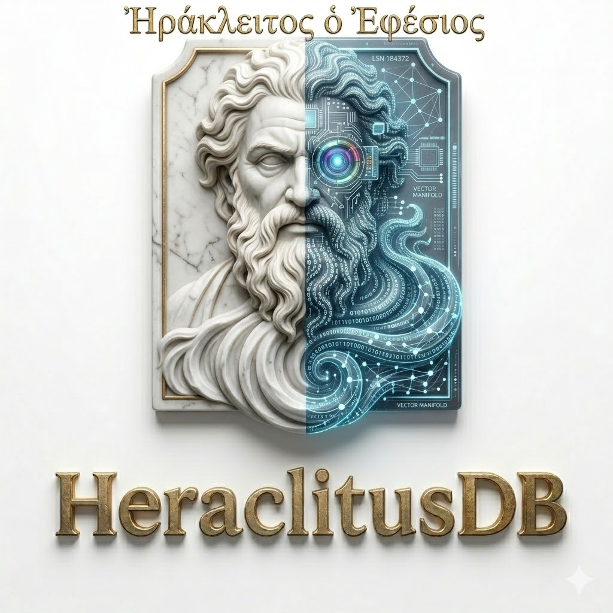

<p align="center">
  
</p>
<p align="center">
  
</p>

<p align="center"><b>O único banco de dados do mundo imune a fraudes retroativas.</b></p>
<p align="center"><i>Auditoria governamental, inteligência contra fraudes e agentes de IA operando com 100% de transparência e zero amnésia estrutural.</i></p>

<p align="center">
  <a href="#️-licença-e-modelo-comercial"></a>
  
  
  
  
  
  
  
  
</p>

---

## 💼 O que é o HeraclitusDB

O **HeraclitusDB** é o primeiro banco de dados de alta performance projetado de raiz para ser **matematicamente imune a adulterações retroativas**. Construído em Rust puro, combina um log *append-only* canônico baseado em árvores Merkle (BLAKE3/SHA-256), variedades geométricas aprendidas ($\mathcal{H} \times \mathcal{S} \times \mathcal{E}$), motor de grafos temporais bi-temporais, fusão de recuperação multi-canal (RRF), plano de segurança autônomo (Sentinel L0–L6) e evidência criptográfica qualificada (RFC 3161 / ICP-Brasil).

Em bancos tradicionais (PostgreSQL, Neo4j, MongoDB), comandos `UPDATE` e `DELETE` destroem a história física. Em ambientes regulados ou na memória de agentes de IA, isso cria duas vulnerabilidades críticas: **adulteração retroativa indetectável** e **amnésia estrutural invisível**.

No HeraclitusDB:
- **A verdade primária é o log de eventos**: nada é sobrescrito ou apagado. Correções ocorrem anexando novos fatos.
- **Viagem no tempo determinística bit-a-bit**: qualquer estado histórico pode ser inspecionado ou reexecutado via `AS OF LSN` ou `AS OF TIMESTAMP`.
- **Integridade verificável a frio**: qualquer manipulação física em disco é imediatamente detectada via provas Merkle canônicas (`db.verify()`).

| Para quem | A dor atual | O que o HeraclitusDB entrega |
| :--- | :--- | :--- |
| **Órgãos de Auditoria e Fiscalização** | Impossibilidade de provar que um dado histórico não foi adulterado ou forjado nos bastidores. | Log imutável + raízes Merkle + carimbos RFC 3161 com validação de cadeia ICP-Brasil e revogação offline por CRL. Fraude retroativa torna-se matematicamente impossível de ocultar. |
| **Agentes de IA e Memória Cognitiva** | Amnésia estrutural: o agente tem seu contexto sobrescrito ou perde a proveniência dos fatos ao longo do tempo. | Memória em fluxo contínuo. Leitura do passado exato (`AS OF`), proveniência causal explícita (`WHY`, `PROVENANCE`) e recuperação ativacional ACT-R O(1). |
| **Investigação de Fraudes e Compliance** | Cruzamento de dados relacionais, vetoriais e grafos com versões concorrentes de hipóteses. | Motor híbrido unificado (Grafo + Vetor + Texto + Atributos), resolução probabilística de entidades (`RESOLVE`), grafo de hipóteses (`log-odds`) e simulações contrafactuais em RAM. |
| **Defesa Cibernética e SOC Governamental** | Detecção reativa desconectada da trilha auditável de evidência e da proveniência dos dados. | Camada **Heraclitus Sentinel (L0–L6)**: normalização determinística, regras Sigma (L1), baseline comportamental (L2), correlação causal em grafo (L3), investigação LLM isolada (L4), governança e execução reversível (L5/L6). |

---

## 🛡️ Os pilares fundamentais

```
                      ┌──────────────────────────────────────────────┐
                      │              Clientes / MCP / SDK            │
                      └────────┬─────────────────────────┬───────────┘
                               │ Append (gRPC/REST)      │ Query / Recall / WHY
                               ▼                         ▼
                      ┌──────────────────┐     ┌──────────────────────┐
                      │  heraclitus-log  │     │ heraclitus-retrieval │
                      │ HRKL v6 Canonical│     │  RRF fuse + rerank   │
                      │  BLAKE3 + CRC32  │     └──────────┬───────────┘
                      └────────┬─────────┘                │ merge(memtable, views)
                tail_subscribe │                          │
            ┌──────────────────┼──────────────────────────┤
            ▼                  ▼                          │
 ┌────────────────┐ ┌──────────────────┐                  │
 │   memtable     │ │ heraclitus-views │                  │
 │ (tail, exact,  │ │  replay engine   │                  │
 │  RYOW < 1ms)   │ │  + checkpoints   │                  │
 └────────────────┘ └────────┬─────────┘                  │
                             │ apply (deterministic)      │
        ┌──────────┬─────────┼──────────┬──────────┐      │
        ▼          ▼         ▼          ▼          ▼      │
    ┌───────┐ ┌────────┐ ┌───────┐ ┌──────────┐ ┌──────┐  │
    │vector │ │ graph  │ │ text  │ │activation│ │attr  │──┘
    │(HNSW) │ │(adj +  │ │(BM25) │ │ (ACT-R)  │ │range │
    └───────┘ │ attrs) │ └───────┘ └──────────┘ └──────┘
              └────────┘
    ▲ todas as views: derivadas, apagáveis, reconstruíveis a partir do LSN 0

 ┌──────────────────────┐    emite SecurityIncident / Action
 │ heraclitus-sentinel  │──────────────► de volta ao LOG canônico
 │ (L0-L6 SOC & Threat) │    (auditoria contínua e sem efeito colateral nas escritas)
 └──────────────────────┘
```

### 1. Imunidade a Fraudes e Integridade Criptográfica
O log do HeraclitusDB é particionado em formatos **HRKL v6** (RAW ou PACKED com compressão Zstd/LZ4) com árvore Merkle BLAKE3 e manifesto `.hrkm`. Cada registro referencia seus ancestrais (`parents: Vec<EventId>`). A integridade lógica sobrevive a repacks e transições de tiering. Testado sob 1.000 injeções de crash durante escrita: **zero perdas e zero corrupções silenciosas**.

### 2. Geometria de Dados Aprendida ($\mathcal{H} \times \mathcal{S} \times \mathcal{E}$)
O HeraclitusDB rejeita a premissa do espaço euclidiano plano para grafos de conhecimento. Hierarquias são mapeadas em variedades hiperbólicas de Poincaré ($\mathcal{H}$), ciclos em esferas de Riemann ($\mathcal{S}$) e grandezas ordinais em espaços euclidianos ($\mathcal{E}$). As curvaturas $\kappa_i$ e dimensões $(a, b, c)$ são aprendidas diretamente da distorção do dado. Distâncias manifold são aceleradas em GPU via **wgpu / WGSL** com fallback determinístico CPU.

### 3. Recuperação Multi-Canal e Causalidade Bi-Temporal
Consultas realizam fusão RRF (*Reciprocal Rank Fusion*) combinando HNSW vetorial, BM25 textual ordenado e ativação ACT-R $O(1)$ determinística. O grafo suporta consultas bi-temporais (`VALID AT` vs `AS OF LSN`), rastreamento causal (`WHY`), proveniência infalsificável (`PROVENANCE`) e simulações contrafactuais puramente em memória (`SIMULATE REMOVE EDGE ... THEN`).

### 4. Soberania, Conformidade e Sentinel SOC
- **Protocolo RFC 3161 + ICP-Brasil**: Ancoragem em Autoridades Certificadoras de Tempo (ACT), validação estrita de cadeias X.509/CMS, verificação de revogação offline por CRL (com tratamento retroativo para `keyCompromise`) e assinaturas híbridas pós-quânticas ML-DSA-44 (FIPS 204).
- **Heraclitus Sentinel (SPEC-0045 & SPEC-0047)**: Monitoramento L0–L6 desacoplado de escrita, detecção Sigma L1, momentos comportamentais EWMA/Welford L2, grafo de incidentes L3, investigação AI com boundary seguro L4, e inteligência de ameaças compatível com STIX 2.1 e TLP 2.0.

---

## 🗂️ Arquitetura do Workspace Rust

O ecossistema HeraclitusDB é estruturado em **28 crates principais** organizados por camadas estritas de responsabilidade:

```
heraclitus-core          ← Tipos fundamentais: Episode, Fact, ProductPoint, HLC, LSN, EBR, VM ISA
heraclitus-log           ← Log canônico HRKL v6 (RAW, PACKED Zstd/LZ4, manifesto .hrkm, sidecar .hrki)
heraclitus-crypto        ← Cifra em repouso ChaCha20-Poly1305, KeyStore por agente, hashes BLAKE3
heraclitus-manifold      ← Geometria produto H×S×E aprendida, transformações de Möbius, mapas exp/log
heraclitus-memtable      ← Cauda síncrona: garantias de Read-Your-Own-Writes em < 1ms
heraclitus-views         ← Motor de replay determinístico e persistência atômica de checkpoints
heraclitus-index-vector  ← HNSW na variedade produto; tombstones semânticos; search_exact_gpu
heraclitus-index-graph   ← Grafo temporal derivado do log; detecção de comunidades Leiden; MATCH AS OF
heraclitus-index-text    ← Índice BM25 invertido com busca fuzzy e tokenização multilíngue
heraclitus-index-attr    ← Índice de atributos ordenado (B-Tree); range scan sem table scan
heraclitus-activation    ← Modelo de ativação ACT-R O(1) determinístico no replay com HLC
heraclitus-retrieval     ← Fusão de ranking RRF: ANN ∥ BM25 ∥ ACT-R → k=60 → reranker
heraclitus-distill       ← Compactação: clustering manifold, re-fit de curvatura e swap blue/green
heraclitus-tier          ← Tiering para Object Storage (S3/GCS), recibos DemotionReceipt e export Parquet
heraclitus-btree         ← Fractal Tree Bᵋ-tree: CoW shadow paging, 4KB pages, checkpoint BLAKE3
heraclitus-gpu           ← Aceleração heterogênea WGSL/wgpu (Intel Arc, NVIDIA, AMD) com fallback CPU
heraclitus-compliance   ← Ancoragem RFC 3161, validador ICP-Brasil X.509/CMS, CRL offline e PQC ML-DSA-44
heraclitus-sentinel     ← Plano de segurança L0-L6, Sigma L1, baseline L2, grafo L3, STIX 2.1 Threat Intel
heraclitus-query         ← Parser pest (GQL/Cypher), query planner lock-free ArcSwap, EXPLAIN, AS OF
heraclitus-txn           ← Transações e isolamento MVCC: Snapshot por LSN, compare_and_append CAS
heraclitus-raft          ← Replicação distribuída de log com OpenRaft 0.9 e tolerância a partições
heraclitus-proto         ← Interfaces Protobuf e gRPC (Tonic / Prost)
heraclitus-server        ← Servidor gRPC (:7474), REST (:7475), boot narrado e métricas operacionais
heraclitus-client        ← Cliente nativo em Rust para gRPC
heraclitus-cli           ← CLI executável: inspect, verify, verify-receipts, anchor, prove, query, bench
heraclitus-analytics     ← Motor SQL OLAP sobre o log via Apache Arrow / DataFusion e Arrow Flight
tools/heraclitus-qualifier ← Suíte de qualificação e auditoria governamental (SPEC-0049)
tools/heraclitus-ingestor  ← Pipeline de ingestão massiva e streaming de alta velocidade
```

---

## 🚀 Como Usar

### 1. Inicialização do Servidor

```bash
# Clonar e compilar
git clone https://github.com/JoseRFJuniorLLMs/HeraclitusDB.git
cd HeraclitusDB

# Rodar a suíte completa de testes
cargo test --workspace

# Iniciar o servidor com boot narrado (gRPC na 7474, REST na 7475)
cargo run -p heraclitus-server
```

### 2. CLI de Operação e Verificação Forense

```bash
# Inspecionar manifesto de armazenamento HRKL v6
cargo run -p heraclitus-cli -- inspect ./data/log

# Verificação criptográfica completa da árvore Merkle
cargo run -p heraclitus-cli -- verify ./data/log --logical

# Gerar prova de inclusão Merkle para um LSN específico
cargo run -p heraclitus-cli -- prove ./data/log --lsn 428931

# Ancoragem de evidência RFC 3161
cargo run -p heraclitus-cli -- anchor ./data/log --receipts ./data/receipts

# Verificação de recibos com validação estrita de cadeia de confiança
cargo run -p heraclitus-cli -- verify-receipts ./data/log --receipts ./data/receipts
```

### 3. SDK Python Oficial

```bash
pip install ./sdk/python
```

```python
import heraclitusdb

# Conexão gRPC de alta performance
db = heraclitusdb.connect("127.0.0.1:7474")

# Append atômico de evento com atributos tipados
lsn = db.append(
    kind="Observation",
    content="Empresa Alfa venceu licitação sem ter funcionários registrados",
    attrs={"licitacao_id": "9921", "orgao": "Ministerio_X", "alvo": "Empresa_Alfa"}
)

# Viagem no tempo (Time-Travel Query)
df_passado = db.query_df("MATCH (n) WHERE n.alvo = 'Empresa_Alfa' RETURN n", as_of=lsn)

# Busca semântica híbrida (RRF)
resultados = db.recall("indícios de empresa fantasma em licitação pública", k=10)

# Verificação Merkle em linha
is_valid = db.verify()
print(f"Log 100% íntegro: {is_valid}")
```

### 4. Servidor MCP Nativo (Memória para Agentes de IA)

O HeraclitusDB inclui suporte oficial ao [Model Context Protocol (MCP)](https://modelcontextprotocol.io). Qualquer cliente (Claude Code, Claude Desktop, Cursor) pode utilizar o HeraclitusDB como memória auditável anti-fraude:

```json
{
  "mcpServers": {
    "heraclitus": {
      "command": "python",
      "args": ["-m", "mcp.heraclitus_mcp"],
      "cwd": "D:/DEV/HeraclitusDB"
    }
  }
}
```
Ferramentas MCP disponíveis: `remember`, `recall`, `query` (com suporte a `AS OF`), `why`, `provenance`, `stats`, `verify`, `state`.

---

## 📊 Benchmarks e Validação em Escala

Os benchmarks do HeraclitusDB são reprodutíveis via `cargo bench --workspace` e suítes de carga dedicadas.

### 1. Carga Real Massiva de 20.000.000 de Eventos (`carga_real_20m.rs`)

Testado em Windows 11 sobre drive NVMe com log particionado em segmentos de 8 MiB:

| Métrica | Resultado a 20 Milhões de Eventos |
| :--- | :--- |
| **Volume Total em Disco** | **9.755,7 MB** distribuídos em 1.164 segmentos de 8 MiB |
| **Throughput de Escrita (Escritor Único)** | **12.533 a 19.954 appends/s** (curva perfeitamente plana do início ao fim) |
| **Throughput Concorrente (8 Escritores)** | **39.217 appends/s** |
| **Varredura Completa do Log (Scan de 20M)** | **96,81 segundos** (~206.596 registros decodificados/s) |
| **Fast Boot a partir de Snapshots** | **28 a 40 milissegundos** (restaura views e replaya apenas a cauda) |

### 2. Busca Vetorial HNSW na Variedade Produto (N = 20.000, Dim = 16)

| ef Search | QPS | Recall@10 | Latência Mediana |
| :---: | :---: | :---: | :---: |
| **16** | **8.589** | **0.996** | ~62,9 µs |
| **32** | **8.734** | **0.996** | ~74,1 µs |
| **64** | **10.051** | **0.996** | ~98,5 µs |

---

## 🏛️ Qualificação e Conformidade Governamental

Através do crate [`tools/heraclitus-qualifier`](tools/heraclitus-qualifier/README.md) e das especificações **SPEC-0046** e **SPEC-0049**, o HeraclitusDB separa declarações de código de atestações formais de auditoria:

```powershell
# Executar plano de pré-voo de auditoria
cargo run -p heraclitus-qualifier -- run --profile gov-production --out qa-evidence/gov-20260901

# Verificar integridade forense do dossiê contra o hash do executável
cargo run -p heraclitus-qualifier -- verify --evidence qa-evidence/gov-20260901 --binary target/release/heraclitus-server.exe

# Diagnóstico estrito de configuração (rejeita chaves incorretas que poderiam desativar TLS)
cargo run -p heraclitus-qualifier -- doctor --config heraclitus.toml

# Gerar SBOM CycloneDX determinístico da cadeia de suprimentos
cargo run -p heraclitus-qualifier -- sbom --out bom.cdx.json
```

---

## 📚 Documentação e Especificações Técnicas

Toda a engenharia do HeraclitusDB é regida por especificações normativas estritas e documentação auditada:

### Especificações e Arquitetura
- [docs/md/SPEC-new/SPEC.md](docs/md/SPEC-new/SPEC.md) — Blueprint arquitetural e especificação mestre
- [docs/md/SPEC-new/SPEC-HRKL-0050.md](docs/md/SPEC-new/SPEC-HRKL-0050.md) — Especificação do Storage Engine HRKL v6 e Projeção Lakehouse
- [docs/md/SPEC-new/SPEC-0045.md](docs/md/SPEC-new/SPEC-0045.md) — Heraclitus Sentinel: Detecção, Investigação e Resposta Autônoma L0–L6
- [docs/md/SPEC-new/SPEC-0046.md](docs/md/SPEC-new/SPEC-0046.md) — Ancoragem Criptográfica RFC 3161, Verificador ICP-Brasil e PQC
- [docs/md/SPEC-new/SPEC-0047.md](docs/md/SPEC-new/SPEC-0047.md) — Inteligência de Ameaças, STIX 2.1 e Sanitização TLP 2.0
- [docs/md/SPEC-new/SPEC-0049.md](docs/md/SPEC-new/SPEC-0049.md) — Framework de Qualificação Governamental e Dossiês de Auditoria
- [docs/md/SPEC-new/SPEC-RESUMO.md](docs/md/SPEC-new/SPEC-RESUMO.md) — Inventário verificado de todas as SPECs contra o código-fonte
- [docs/md/SPEC-new/STATUS.md](docs/md/SPEC-new/STATUS.md) — Status detalhado da auditoria adversarial contínua
- [docs/BLOQUEIOS-PRODUCAO.md](docs/BLOQUEIOS-PRODUCAO.md) — Matriz de bloqueios para certificação de produção

### Notas de Release e Auditorias
- [docs/md/RELEASE_NOTES_v1.0.5.md](docs/md/RELEASE_NOTES_v1.0.5.md) — Patch crítico de resiliência e integridade em disco (v1.0.5)
- [docs/md/RELEASE_NOTES_v1.0.4.md](docs/md/RELEASE_NOTES_v1.0.4.md) — Versão estável v1.0.4
- [docs/md/auditorias/otimizacao-20m.md](docs/md/auditorias/otimizacao-20m.md) — Relatório da carga e otimização de 20 milhões de registros
- [docs/qualification/README.md](docs/qualification/README.md) — Procedimentos operacionais de qualificação e runbooks normativos
- [docs/runbooks/README.md](docs/runbooks/README.md) — Runbooks de sustentação em produção e recuperação de desastres

---

## ⚖️ Licença e Modelo Comercial

O **núcleo** do HeraclitusDB é distribuído sob a **Business Source License 1.1 (BSL 1.1)**:
- ✅ **Livre** para leitura, auditoria de segurança, modificação, pesquisa, testes e desenvolvimento.
- ✅ **Código-fonte 100% aberto** e verificável.
- 💰 **Uso em produção comercial requer licença.**
- 🔓 **Data de conversão:** em **2030-06-21**, todas as versões convertem automaticamente para a licença **Apache-2.0**.

Consulte o arquivo [LICENSE](LICENSE) para termos completos.

---

<p align="center">
  <b>HeraclitusDB</b> — Desenvolvido por <b>José R. F. Junior</b> (Servidor Público Federal — SIAPE nº 1.634.972)<br>
  Contato: <a href="mailto:joseribamar.junior@inss.gov.br">joseribamar.junior@inss.gov.br</a> / <a href="mailto:web2ajax@gmail.com">web2ajax@gmail.com</a>
</p>

<p align="center">
  <i>"Panta rhei — nenhum homem pisa no mesmo rio duas vezes. E nenhum fraudador reescreve um rio que já fluiu."</i>
</p>
